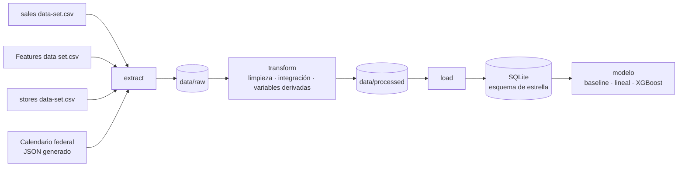

# Pronóstico de ventas semanales por tienda y departamento

> Pipeline ETL que integra el histórico de ventas de 45 tiendas con variables externas y un
> calendario oficial de festivos de EE. UU., y entrega un conjunto de datos modelado en esquema
> de estrella, listo para pronosticar la venta de la semana siguiente por tienda y departamento.

**Curso:** ETL — Maestría en Inteligencia Artificial y Ciencia de Datos, Universidad Autónoma de Occidente
**Periodo:** 2026-2
**Docente:** Fernando Barraza Alvarado

## Integrantes

| Nombre | Código | Usuario de GitHub |
|---|---|---|
| Gustavo Adolfo Buelvas Macea | [1003500311] | [@TavoBuelvas](https://github.com/TavoBuelvas) |
| Alberto Fontalvo Pineda | [código] | [@usuario] |
| Alexander Ortega Muñoz | [código] | [@usuario] |
| Esteban Urueña Sanmiguel | [código] | [@usuario] |

## Tabla de contenido

1. [Descripción del problema](#1-descripción-del-problema)
2. [Fuentes de datos](#2-fuentes-de-datos)
3. [Arquitectura del pipeline](#3-arquitectura-del-pipeline)
4. [Estructura del repositorio](#4-estructura-del-repositorio)
5. [Requisitos](#5-requisitos)
6. [Instalación y configuración](#6-instalación-y-configuración)
7. [Ejecución](#7-ejecución)
8. [Detalle de las etapas ETL](#8-detalle-de-las-etapas-etl)
9. [Modelo y diccionario de datos](#9-modelo-y-diccionario-de-datos)
10. [Calidad de datos y validaciones](#10-calidad-de-datos-y-validaciones)
11. [Resultados](#11-resultados)
12. [Limitaciones y trabajo futuro](#12-limitaciones-y-trabajo-futuro)
13. [Referencias](#13-referencias)

## 1. Descripción del problema

Una cadena minorista con 45 tiendas y 81 departamentos necesita anticipar la venta de la semana
siguiente en cada combinación tienda–departamento para dimensionar la reposición de inventario.
Hoy la decisión se toma sobre el histórico plano, sin incorporar el efecto de las temporadas
comerciales ni de las condiciones externas, lo que produce quiebres de inventario justo en las
semanas de mayor facturación del año.

Los datos de origen presentan tres obstáculos que impiden usarlos directamente, y los tres se
detectaron en el análisis exploratorio de la entrega anterior:

1. **La bandera de festivos del sistema señala la semana equivocada.** De las cuatro semanas de
   mayor venta del histórico, solo dos están marcadas como festivo. La semana que concentra la
   compra de Navidad —la anterior al 25 de diciembre— aparece sin marcar, mientras que la semana
   siguiente, ya con las tiendas vacías, sí lo está.
2. **Las variables de promoción no existen en los primeros 21 meses.** Los cinco campos de
   descuento están vacíos hasta el 11 de noviembre de 2011. Un nulo antes de esa fecha significa
   "no se medía"; después significa "no hubo promoción". Son dos cosas distintas y rellenarlas
   igual borra esa diferencia.
3. **Los indicadores macroeconómicos funcionan como identificador regional.** El CPI y el
   desempleo varían mucho más entre tiendas que a lo largo del tiempo: el modelo no aprende
   "cuando sube la inflación, baja la venta", aprende "esta tienda es la 23".

**Objetivo:** entregar un conjunto de datos integrado y modelado en esquema de estrella, con las
variables derivadas que la estacionalidad anual exige, sobre el cual se entrena y evalúa un
modelo de pronóstico a una semana por tienda y departamento, comparado contra una línea base.

## 2. Fuentes de datos

| Fuente | Tipo | Origen / URL | Tamaño aprox. | Frecuencia | Licencia |
|---|---|---|---|---|---|
| `sales data-set.csv` | CSV | [Retail Data Analytics (Kaggle)](https://www.kaggle.com/datasets/manjeetsingh/retaildataset) | 421.570 filas × 5 columnas (13 MB) | histórico cerrado | Uso público y académico según la ficha del dataset |
| `Features data set.csv` | CSV | [Retail Data Analytics (Kaggle)](https://www.kaggle.com/datasets/manjeetsingh/retaildataset) | 8.190 filas × 12 columnas (587 KB) | histórico cerrado | Uso público y académico según la ficha del dataset |
| `stores data-set.csv` | CSV | [Retail Data Analytics (Kaggle)](https://www.kaggle.com/datasets/manjeetsingh/retaildataset) | 45 filas × 3 columnas (577 bytes) | estático | Uso público y académico según la ficha del dataset |
| Calendario de festivos de EE. UU. | JSON (generado) | `pandas.tseries.holiday.USFederalHolidayCalendar`, complementado con las fechas de Super Bowl y de Navidad | 182 semanas × 10 campos (66 KB) | anual | Dominio público (calendario federal) |

**Por qué el calendario cuenta como segunda fuente.** No es una copia de la bandera que ya traía
el archivo de variables externas: se construye de forma independiente a partir del calendario
federal de EE. UU. y de las fechas de Super Bowl, y es precisamente lo que permite **auditar y
corregir** esa bandera. La integración no agrega una columna más: cambia el valor de una columna
que venía mal.

**Cobertura temporal:** 143 semanas con ventas, del 5 de febrero de 2010 al 26 de octubre de
2012. El archivo de variables externas llega hasta el 26 de julio de 2013; las semanas sin venta
asociada se descartan en la etapa de transformación.

**Llaves de integración:**

| Unión | Llave | Cardinalidad |
|---|---|---|
| ventas → tiendas | `Store` | muchos a uno |
| ventas → variables externas | `Store` + `Date` | muchos a uno |
| ventas → calendario de festivos | `Date` | muchos a uno |

Las tres uniones se validan con `validate="many_to_one"` de pandas y una aserción posterior sobre
el número de filas, para garantizar que la integración no duplique ni pierda registros.

## 3. Arquitectura del pipeline



El pipeline se ejecuta **por lotes**: no se requiere procesamiento en tiempo real porque el
horizonte de decisión es semanal y las fuentes se publican por periodos cerrados. El destino es
una base SQLite con modelo dimensional, elegida por ser un motor sin servidor que vive en un
archivo y permite reproducir el resultado sin infraestructura adicional.

El orquestador `pipeline.py` encadena las cuatro etapas en un solo proceso y es **idempotente**:
cada corrida vuelve a crear el esquema con `DROP TABLE IF EXISTS` antes de cargar, de modo que
ejecutarlo diez veces produce exactamente el mismo resultado y no duplica registros.

**Tecnologías:** Python 3.11+, pandas, NumPy, scikit-learn, XGBoost, SQLite, Matplotlib, Seaborn.

## 4. Estructura del repositorio

```
├── data
│   ├── raw            <- Datos originales, sin modificar.
│   └── processed      <- Dataset final y base SQLite (se generan al ejecutar el pipeline).
│
├── extract            <- extraer.py: lectura de los tres CSV y generación del calendario.
│
├── transform          <- transformar.py: limpieza, integración y variables derivadas.
│
├── load               <- cargar.py: carga al esquema de estrella en SQLite.
│
├── modelo             <- entrenar.py: entrenamiento y evaluación de los modelos.
│
├── notebooks          <- Análisis exploratorio y de calidad (Entrega 2), como evidencia.
│
├── docs               <- Figuras del análisis exploratorio.
│
├── sql                <- crear_esquema.sql: DDL de la bodega y consultas de verificación.
│
├── config.py          <- Rutas y parámetros compartidos por todas las etapas.
│
├── pipeline.py        <- Orquesta la ejecución completa (extract → transform → load → modelo).
│
├── requirements.txt   <- Dependencias del proyecto.
│
├── .gitignore         <- Archivos que git debe ignorar.
│
└── README.md          <- Este archivo.
```

Los productos de `data/processed/` **no se versionan**: están excluidos en el `.gitignore` porque
son resultados generados, no fuentes. Se obtienen ejecutando el pipeline, que es justamente la
prueba de que el pipeline funciona.

## 5. Requisitos

- Python 3.11 o superior
- Dependencias listadas en `requirements.txt` (pandas, NumPy, scikit-learn, XGBoost, Matplotlib, Seaborn)
- No se requiere servidor de base de datos: SQLite viene incluido en la biblioteca estándar de Python.
- Memoria: la corrida completa se mantiene por debajo de 2 GB de RAM.

## 6. Instalación y configuración

```bash
# 1. Clonar el repositorio
git clone https://github.com/TavoBuelvas/etl-pronostico-ventas-retail.git
cd etl-pronostico-ventas-retail

# 2. Crear y activar el entorno virtual
python -m venv .venv
source .venv/bin/activate        # Windows: .venv\Scripts\activate

# 3. Instalar dependencias
pip install -r requirements.txt
```

### Variables de entorno

Este proyecto no requiere credenciales ni variables de entorno: todas las fuentes son archivos
locales y el calendario de festivos se genera con la biblioteca `pandas`.

### Obtención de los datos

Los tres archivos CSV están incluidos en `data/raw/`. El calendario de festivos lo genera la
etapa de extracción en `data/processed/calendario_festivos.json`; no hay que descargar nada ni
consultar ninguna API.

## 7. Ejecución

```bash
# Pipeline completo: extract → transform → load → modelo
python pipeline.py
```

```bash
# Solo ETL, sin entrenar modelos
python pipeline.py --sin-modelo
```

**Salida esperada.** La corrida completa toma **entre 30 y 45 segundos** en un equipo de
escritorio y genera tres archivos en `data/processed/`:

| Archivo | Contenido | Tamaño |
|---|---|---|
| `calendario_festivos.json` | Segunda fuente: 182 semanas con sus eventos comerciales | 66 KB |
| `ventas_dw.sqlite` | Bodega de datos en esquema de estrella (4 tablas) | 59 MB |
| `ventas_integrado_limpio.csv.gz` | Dataset analítico integrado, 416.615 filas × 52 columnas | 38,6 MB |

La consola va reportando el conteo de filas en cada etapa, de modo que cualquier pérdida o
duplicación de registros queda visible en el momento en que ocurre.

## 8. Detalle de las etapas ETL

### 8.1 Extract

- **Qué hace:** lee los tres CSV de `data/raw/` con el formato de fecha explícito
  (`%d/%m/%Y`, día primero, como vienen en el archivo), y construye el calendario de festivos a
  partir de `USFederalHolidayCalendar` más las fechas de Super Bowl. El calendario se genera
  **desde 2009**, un año antes del inicio de las ventas, para que las variables de distancia a
  evento tengan referencia en la primera semana del histórico y no queden nulas.
- **Script:** `extract/extraer.py`
- **Salida:** los tres DataFrames en memoria y `data/processed/calendario_festivos.json`

El calendario se publica como JSON anidado (metadatos + lista de registros semanales), lo que
documenta la segunda fuente de forma legible y permite reutilizarla sin volver a calcularla.

### 8.2 Transform

- **Qué hace:** recorta, limpia, integra las cuatro fuentes y construye las variables derivadas.
- **Script:** `transform/transformar.py`
- **Salida:** un DataFrame de 416.615 filas × 52 columnas

| # | Transformación | Justificación |
|---|---|---|
| 1 | Recorte de las variables externas al periodo con ventas (8.190 → 6.435 filas) | Las semanas posteriores a oct-2012 no tienen venta asociada y concentran el **100 % de los 585 nulos** de CPI y desempleo. Recortar primero elimina el problema en su origen en lugar de imputarlo |
| 2 | Corrección de la bandera de festivos con el calendario federal | La bandera original marca la semana posterior al pico de compra. Sin corregirla, el modelo aprende el efecto navideño invertido. Se reconstruye mirando **6 días hacia atrás** desde el viernes de cierre, porque la semana comercial termina ese día |
| 3 | Tratamiento estratificado de las variables de promoción | Antes del 11-nov-2011 el dato no se registraba; después, el nulo significa ausencia de promoción. Se crea la bandera `MD_Registrado` para distinguir los dos mecanismos, y solo entonces se rellena con 0 |
| 4 | 23 valores negativos de promoción llevados a 0 | Un descuento negativo no tiene interpretación de negocio; son ajustes contables |
| 5 | Ventas negativas marcadas, no eliminadas (1.285 registros) | Son devoluciones y ajustes, no errores de captura. Se conservan en `Weekly_Sales` para la trazabilidad contable y se crea `Ventas_Modelo` con piso en 0 para el modelado, más la bandera `Es_Devolucion` |
| 6 | Exclusión de series con menos de 52 semanas (340 de 3.331 series) | Una serie con menos de un año no alcanza a mostrar un ciclo estacional completo, y el rezago anual no existe para ella. Se conserva el **98,8 %** de las filas |
| 7 | Winsorización al percentil 99 **solo fuera de semanas de evento** | Los picos de Navidad y Acción de Gracias son exactamente la señal que el proyecto quiere predecir. Recortarlos sería borrar la respuesta. De los 5.857 valores extremos detectados por Z-score, **3.164 se conservan** por caer en semana de evento |
| 8 | Construcción de rezagos por unión de fechas, no con `shift()` | `shift()` toma la fila anterior, que no siempre es la semana anterior. Uniendo por fecha exacta, un hueco en la serie produce un **nulo honesto** en lugar del valor de otra semana |
| 9 | Normalización de la venta por tamaño de tienda (`Ventas_por_1000_Size`) | Permite comparar departamentos entre tiendas de 34.000 y de 220.000 pies cuadrados |
| 10 | Separación del CPI y el desempleo en nivel medio y desviación temporal | El nivel medio identifica la región y pertenece a la dimensión tienda; solo la desviación respecto a ese nivel es señal macroeconómica real. Se aplica en la etapa de carga |

### 8.3 Load

- **Qué hace:** construye las tres dimensiones y la tabla de hechos, recrea el esquema y carga.
  Antes de cerrar, ejecuta una consulta de verificación con el `JOIN` de tres tablas.
- **Script:** `load/cargar.py`
- **Destino:** `data/processed/ventas_dw.sqlite` y `data/processed/ventas_integrado_limpio.csv.gz`

| Tabla | Filas cargadas |
|---|---|
| `dim_tienda` | 45 |
| `dim_departamento` | 76 |
| `dim_fecha` | 143 |
| `hechos_ventas` | 416.615 |

El esquema está documentado también como SQL plano en
[`sql/crear_esquema.sql`](sql/crear_esquema.sql), idéntico al DDL que ejecuta `load/cargar.py`,
con las consultas de verificación de conteos e integridad referencial incluidas al final.

### 8.4 Modelo

- **Qué hace:** separa entrenamiento y prueba por fecha de corte, entrena tres modelos y los
  compara con las mismas métricas.
- **Script:** `modelo/entrenar.py`

La separación es **temporal**, no aleatoria: entrena con todo lo anterior al 1 de agosto de 2012
y evalúa sobre lo posterior. Una separación aleatoria dejaría semanas futuras en el entrenamiento
y produciría métricas infladas que no se sostienen en producción. El escalador se ajusta
**únicamente con los datos de entrenamiento**, por la misma razón.

## 9. Modelo y diccionario de datos

```mermaid
erDiagram
    dim_tienda       ||--o{ hechos_ventas : Store
    dim_departamento ||--o{ hechos_ventas : Dept
    dim_fecha        ||--o{ hechos_ventas : Date

    dim_tienda {
        INTEGER Store PK
        TEXT Type
        INTEGER Size
        REAL CPI_medio
        REAL Desempleo_medio
    }
    dim_departamento {
        INTEGER Dept PK
    }
    dim_fecha {
        TEXT Date PK
        INTEGER Anio
        INTEGER Mes
        INTEGER Semana_Anio
        INTEGER Trimestre
        INTEGER IsHoliday
        INTEGER IsHoliday_Corregido
        REAL Dias_a_Navidad
    }
    hechos_ventas {
        INTEGER Store PK_FK
        INTEGER Dept PK_FK
        TEXT Date PK_FK
        REAL Weekly_Sales
        REAL Ventas_Winsor
        REAL Ventas_t_menos_1
        REAL Ventas_t_menos_52
        REAL Media_Movil_4
    }
```

El grano de la tabla de hechos es **una tienda, un departamento, una semana**. La llave primaria
compuesta `(Store, Dept, Date)` impide por diseño que se cuele un registro duplicado, incluso si
el pipeline se ejecutara dos veces sobre la misma base.

`dim_departamento` es una **dimensión degenerada**: el archivo de origen no trae nombre ni
categoría de departamento, solo el número. Se mantiene como tabla para dejar el punto de
extensión listo el día que exista el catálogo, y para que las tres llaves foráneas de la tabla de
hechos apunten a dimensiones reales.

### `hechos_ventas` (tabla de hechos)

| Columna | Tipo | Descripción | Ejemplo |
|---|---|---|---|
| `Store` | INTEGER | Identificador de la tienda (PK, FK a `dim_tienda`) | 1 |
| `Dept` | INTEGER | Identificador del departamento (PK, FK a `dim_departamento`) | 1 |
| `Date` | TEXT | Viernes de cierre de la semana comercial (PK, FK a `dim_fecha`) | 2010-02-05 |
| `Weekly_Sales` | REAL | Venta semanal original, incluidos valores negativos por devolución | 24924.5 |
| `Ventas_Modelo` | REAL | Venta con piso en 0, para modelado | 24924.5 |
| `Ventas_Winsor` | REAL | Venta winsorizada al P99 fuera de semanas de evento. **Variable objetivo** | 24924.5 |
| `Log_Ventas` | REAL | `log(1 + Ventas_Winsor)`, para corregir la asimetría de la distribución | 10.12 |
| `Ventas_t_menos_1` | REAL | Venta de la semana anterior, por unión de fecha exacta | 24924.5 |
| `Ventas_t_menos_52` | REAL | Venta de la misma semana del año anterior | 24924.5 |
| `Media_Movil_4` | REAL | Promedio de las 4 semanas anteriores | 23010.8 |
| `Total_MarkDown` | REAL | Suma de los cinco campos de promoción de la semana | 0.0 |
| `MD_Registrado` | INTEGER | 1 si la semana está dentro del periodo en que sí se medía la promoción | 0 |
| `Temperatura_C` | REAL | Temperatura media de la semana en grados Celsius | 5.73 |
| `CPI_desv` | REAL | Desviación del CPI respecto al nivel medio de la tienda | -4.34 |
| `Desempleo_desv` | REAL | Desviación del desempleo respecto al nivel medio de la tienda | 0.49 |
| `Es_Devolucion` | INTEGER | 1 si la venta original era negativa | 0 |
| `Outlier_Z` | INTEGER | 1 si la venta se desvía más de 3 desviaciones de la media de su serie | 0 |

### `dim_tienda`

| Columna | Tipo | Descripción | Ejemplo |
|---|---|---|---|
| `Store` | INTEGER | Identificador de la tienda (PK) | 1 |
| `Type` | TEXT | Tipo de tienda: A, B o C | A |
| `Size` | INTEGER | Superficie en pies cuadrados | 151315 |
| `CPI_medio` | REAL | Nivel medio del índice de precios en el periodo. Actúa como identificador regional | 215.999 |
| `Desempleo_medio` | REAL | Nivel medio de desempleo en el periodo | 7.611 |

### `dim_fecha`

| Columna | Tipo | Descripción | Ejemplo |
|---|---|---|---|
| `Date` | TEXT | Viernes de cierre de la semana comercial (PK) | 2010-02-12 |
| `Anio`, `Mes`, `Trimestre` | INTEGER | Componentes de calendario | 2010, 2, 1 |
| `Semana_Anio` | INTEGER | Número de semana ISO | 6 |
| `Semana_Del_Mes` | INTEGER | Semana dentro del mes (1 a 5) | 2 |
| `Es_Diciembre` | INTEGER | 1 si el mes es diciembre | 0 |
| `Es_Temporada_Alta` | INTEGER | 1 si el mes es noviembre o diciembre | 0 |
| `IsHoliday` | INTEGER | Bandera **original** del sistema, conservada para auditoría | 1 |
| `IsHoliday_Corregido` | INTEGER | Bandera reconstruida con el calendario federal. **La que usa el modelo** | 1 |
| `Sem_Pre_Navidad` | INTEGER | 1 si es la semana que concentra la compra de Navidad | 0 |
| `Dias_a_Navidad` | REAL | Días hasta el próximo 25 de diciembre | 316.0 |
| `Dias_desde_Navidad` | REAL | Días desde el 25 de diciembre anterior | 49.0 |

### `dim_departamento`

| Columna | Tipo | Descripción | Ejemplo |
|---|---|---|---|
| `Dept` | INTEGER | Identificador del departamento (PK) | 1 |

## 10. Calidad de datos y validaciones

| Verificación | Antes | Después |
|---|---|---|
| Número de registros de venta | 421.570 | 416.615 (98,8 % conservado) |
| Registros duplicados por `Store`+`Dept`+`Date` | 0 | 0, garantizado por la llave primaria compuesta |
| Nulos en CPI y desempleo | 585 | 0 |
| Nulos en las cinco variables de promoción | 22.870 | 0, con `MD_Registrado` para no perder la distinción |
| Valores negativos de promoción | 23 | 0 |
| Ventas negativas | 1.285 | 1.285 conservadas y marcadas con `Es_Devolucion` |
| Semanas de mayor venta marcadas como festivo | 2 de 4 | 4 de 4 |
| Series tienda–departamento con historia suficiente | 2.991 de 3.331 | 2.991 (las 340 restantes se excluyen con criterio documentado) |
| Departamentos representados | 81 | 76 |
| Integridad de las uniones | — | `validate="many_to_one"` en las tres uniones + aserción sobre el conteo de filas |
| Nulos en el dataset integrado | — | Ninguna columna con nulos, salvo los rezagos en las primeras semanas de cada serie |

### Evidencia de la corrección de la bandera de festivos

Esta es la consulta que demuestra el hallazgo central del proyecto. Son las diez semanas de mayor
venta de toda la cadena, con la bandera original y la corregida al lado:

| Fecha | Venta (millones) | `IsHoliday` original | `IsHoliday_Corregido` |
|---|---|---|---|
| 2010-12-24 | 80,9 | **0** | **1** |
| 2011-12-23 | 76,9 | **0** | **1** |
| 2011-11-25 | 66,5 | 1 | 1 |
| 2010-11-26 | 65,8 | 1 | 1 |
| 2010-12-17 | 61,8 | 0 | 0 |
| 2011-12-16 | 60,0 | 0 | 0 |
| 2010-12-10 | 55,7 | 0 | 0 |
| 2011-12-09 | 55,5 | 0 | 0 |
| 2012-04-06 | 53,5 | 0 | 0 |
| 2012-07-06 | 51,2 | 0 | 0 |

**Las dos semanas de mayor facturación del histórico —las de Navidad— venían sin marcar.** Son
justo las dos que el negocio más necesita anticipar. La corrección afecta exactamente dos de las
143 semanas, pero son las dos que concentran 158 millones de venta.

De Navidad, la bandera original solo marcaba las semanas del 31 de diciembre de 2010 y del 30 de
diciembre de 2011: la semana *siguiente* al pico, con las tiendas ya vacías. Un modelo entrenado
con esa bandera aprende que "festivo" significa venta baja, que es lo contrario de lo que pasa.
La corrección no mueve la marca, la **agrega** donde faltaba, y conserva la original en
`dim_fecha.IsHoliday` para que el cambio sea auditable con esta misma consulta.

**Sobre los nulos de los rezagos.** `Ventas_t_menos_1` tiene 6.200 nulos y `Ventas_t_menos_52`
tiene 155.541. No son un defecto: son la consecuencia honesta de construir los rezagos por unión
de fecha. La primera semana de cada serie no tiene semana anterior, y el primer año completo no
tiene año anterior. Rellenarlos habría inventado historia que no existe; el modelo trabaja con
las filas que sí tienen el dato.

## 11. Resultados

El pipeline entrega el dataset integrado y la bodega en esquema de estrella, y sobre ellos se
comparan tres modelos con la misma separación temporal: 372.803 filas de entrenamiento (hasta el
27 de julio de 2012) y 37.612 de prueba (desde el 3 de agosto de 2012).

| Modelo | MAE | RMSE | WMAE |
|---|---|---|---|
| Persistencia (la venta de la semana anterior, sin modelo) | 1.521 | 3.385 | 1.671 |
| Regresión lineal | 1.408 | 3.053 | 1.564 |
| **XGBoost** | **1.279** | **2.712** | **1.363** |

La venta promedio real en el periodo de prueba es de **15.989**, de modo que el error del mejor
modelo equivale a cerca del **8 % de la venta típica**.

**Por qué está la fila de persistencia.** Es el punto de referencia sin el cual las otras dos
cifras no significan nada. "MAE de 1.279" no dice si el modelo es bueno; "1.279 contra 1.521 de
no hacer nada" dice que el modelo aporta una **mejora del 16 %** sobre la regla más simple
posible. La misma comparación muestra que la regresión lineal apenas supera a la persistencia en
un 7 %, lo que justifica pasar a un modelo no lineal.

La métrica **WMAE** es el error absoluto medio ponderado, con peso 5 en las semanas de evento
comercial y 1 en el resto. Es la métrica oficial de la competencia original, y castiga
precisamente los errores que más cuestan en el negocio: equivocarse en la semana de Navidad vale
cinco veces más que equivocarse en una semana cualquiera de marzo.

### Variables más influyentes (XGBoost)

| Variable | Importancia |
|---|---|
| `log_Ventas_t_menos_1` | 0,743 |
| `log_Media_Movil_4` | 0,191 |
| `Anio` | 0,006 |
| `log_Ventas_t_menos_52` | 0,005 |
| `Dias_a_Navidad` | 0,005 |
| `Mes` | 0,004 |

El rezago de una semana concentra tres cuartas partes del poder predictivo, y junto con la media
móvil de cuatro semanas explica el 93 %. Esto confirma que la venta de un departamento es
fuertemente autorregresiva, y es también la razón por la cual la persistencia es un competidor
tan difícil de superar.

### Consulta de verificación sobre la bodega

```sql
-- Venta total y número de registros por tipo de tienda
SELECT t.Type,
       COUNT(*)                            AS filas,
       ROUND(SUM(h.Weekly_Sales)/1e6, 1)   AS venta_millones
FROM hechos_ventas h
JOIN dim_tienda t ON h.Store = t.Store
JOIN dim_fecha  f ON h.Date  = f.Date
GROUP BY t.Type
ORDER BY t.Type;
```

| Type | filas | venta_millones |
|---|---|---|
| A | 212.948 | 4.330,6 |
| B | 162.105 | 2.000,6 |
| C | 41.562 | 405,5 |

### Evidencia de ejecución

```
==============================================================
PIPELINE ETL — Pronóstico de ventas semanales
==============================================================
[E] Extracción
  ventas   421,570 filas x 5 columnas
  features   8,190 filas x 12 columnas
  tiendas       45 filas x 3 columnas
  calendario   182 semanas · 16 marcadas como evento
[T] Transformación
  recorte temporal: 8,190 -> 6,435 filas (hasta 2012-10-26) · nulos de CPI: 0
  markdown: registro desde 2011-11-11 · 23 negativos llevados a 0 · nulos restantes 0
  integrado: 421,570 filas · columnas con nulos: ninguna
  devoluciones marcadas: 1,285
  series cortas excluidas: 421,570 -> 416,615 filas (98.8% conservado) · 340 series fuera
  outliers: 5,857 detectados · 3,164 conservados por caer en semana de evento
  rezagos: nulos en t-1 6,200 · en t-52 155,541
  derivadas: 52 columnas en el dataset final
[L] Carga
  dim_tienda                45 filas
  dim_departamento          76 filas
  dim_fecha                143 filas
  hechos_ventas        416,615 filas
  dataset final: ventas_integrado_limpio.csv.gz (38.6 MB)
[M] Modelo
  train 372,803 filas (hasta 2012-07-27)
  test   37,612 filas (desde 2012-08-03)

  Modelo                             MAE      RMSE      WMAE
  Persistencia (sin modelo)        1,521     3,385     1,671
  Regresión lineal                 1,408     3,053     1,564
  XGBoost                          1,279     2,712     1,363
==============================================================
Pipeline completo en 32.3 s
==============================================================
```

## 12. Limitaciones y trabajo futuro

- **El horizonte es de una semana.** El rezago de una semana concentra el 74 % del poder
  predictivo y ese predictor no está disponible a horizontes más largos. Pronosticar a un mes
  exigiría un modelo distinto, construido sobre la media móvil y la estacionalidad anual.
- **La cobertura es de 143 semanas**, es decir, dos ciclos anuales completos y medio. Alcanza
  para describir la estacionalidad anual, pero no para validar si es estable entre años.
- **Las variables de promoción solo existen en el último 40 % del periodo.** Su efecto real está
  subestimado: el modelo las ve como ausentes durante 21 de los 33 meses del histórico.
- **El CPI y el desempleo son mensuales e interpolados**, mientras el grano del análisis es
  semanal. La desviación temporal que se conservó es, en la práctica, una señal de muy baja
  frecuencia.
- **No hay catálogo de departamentos.** Sin el nombre o la categoría de cada departamento no se
  puede agrupar por línea de producto, que es la pregunta de negocio inmediatamente siguiente.
- **Trabajo futuro:** validación cruzada temporal deslizante en lugar de un solo corte;
  construcción de un modelo por tipo de tienda; incorporación de una fuente meteorológica de
  mayor resolución; y un modelo específico para las dos semanas de Navidad, que por sí solas
  concentran 158 millones de venta y hoy comparten modelo con una semana cualquiera de marzo.

## 13. Referencias

- **Datos primarios:** Singh, M. *Retail Data Analytics*. Kaggle.
  https://www.kaggle.com/datasets/manjeetsingh/retaildataset — consultado en octubre de 2026.
  Derivado de la competencia *Walmart Recruiting — Store Sales Forecasting*, de donde se toma
  también la definición de la métrica WMAE con peso 5 en las semanas de evento.
- **Calendario de festivos:** `pandas.tseries.holiday.USFederalHolidayCalendar`, documentación de
  pandas. https://pandas.pydata.org/docs/reference/api/pandas.tseries.holiday.USFederalHolidayCalendar.html
- **Modelo dimensional:** Kimball, R. y Ross, M. *The Data Warehouse Toolkit*, 3.ª edición. Wiley, 2013.
- **XGBoost:** Chen, T. y Guestrin, C. *XGBoost: A Scalable Tree Boosting System*. KDD 2016.
- **Estructura del repositorio:** plantilla *Cookiecutter Data Science*, adaptada a la rúbrica del curso.
- **Uso de herramientas de IA generativa:** se usó Claude (Anthropic) como apoyo en la revisión de
  código, la discusión de decisiones de diseño del pipeline y la redacción de esta documentación.
  Las decisiones técnicas, la verificación de los resultados y la ejecución del pipeline son del
  equipo; todas las cifras reportadas provienen de corridas propias y verificables con el comando
  de la sección 7.
