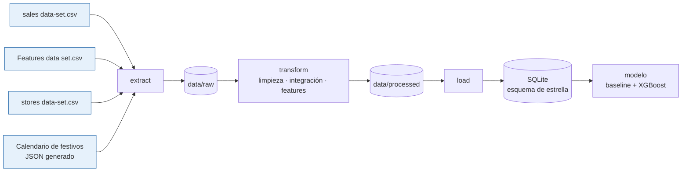

# Pronóstico de ventas semanales por tienda y departamento

> Pipeline ETL que integra el histórico de ventas de 45 tiendas con variables externas y un
> calendario oficial de festivos de EE. UU., y entrega un conjunto de datos modelado en esquema
> de estrella, listo para pronosticar la venta de la semana siguiente por tienda y departamento.

**Curso:** ETL — Maestría en Inteligencia Artificial y Ciencia de Datos, Universidad Autónoma de Occidente
**Periodo:** 2026-2
**Docente:** Fernando Barraza Alvarado

## Integrantes

| Nombre | Código | Usuario de GitHub |
|---|---|---|
| Gustavo Adolfo Buelvas Macea | [código] | [@usuario] |
| Alberto Fontalvo Pineda | [código] | [@usuario] |
| Alexander Ortega Muñoz | [código] | [@usuario] |
| Esteban Urueña Sanmiguel | [código] | [@usuario] |

## Tabla de contenido

1. [Descripción del problema](#1-descripción-del-problema)
2. [Fuentes de datos](#2-fuentes-de-datos)
3. [Arquitectura del pipeline](#3-arquitectura-del-pipeline)
4. [Estructura del repositorio](#4-estructura-del-repositorio)
5. [Requisitos](#5-requisitos)
6. [Instalación y configuración](#6-instalación-y-configuración)
7. [Ejecución](#7-ejecución)
8. [Detalle de las etapas ETL](#8-detalle-de-las-etapas-etl)
9. [Modelo y diccionario de datos](#9-modelo-y-diccionario-de-datos)
10. [Calidad de datos y validaciones](#10-calidad-de-datos-y-validaciones)
11. [Resultados](#11-resultados)
12. [Limitaciones y trabajo futuro](#12-limitaciones-y-trabajo-futuro)
13. [Referencias](#13-referencias)

## 1. Descripción del problema

Una cadena minorista con 45 tiendas y 81 departamentos necesita anticipar la venta de la semana
siguiente en cada combinación tienda–departamento para dimensionar la reposición de inventario.
Hoy la decisión se toma sobre el histórico plano, sin incorporar el efecto de las temporadas
comerciales ni de las condiciones externas, lo que produce quiebres de inventario justo en las
semanas de mayor facturación del año.

Los datos de origen presentan tres obstáculos que impiden usarlos directamente: la bandera de
festivos del sistema señala la semana posterior al pico real de compra, las variables de
promoción no se registraron durante los primeros 21 meses del periodo, y los indicadores
macroeconómicos funcionan como identificador regional en lugar de como señal temporal.

**Objetivo:** entregar un conjunto de datos integrado y modelado en esquema de estrella, con las
variables derivadas que la estacionalidad anual exige, sobre el cual se entrena y evalúa un
modelo de pronóstico a una semana por tienda y departamento.

## 2. Fuentes de datos

| Fuente | Tipo | Origen / URL | Tamaño aprox. | Frecuencia | Licencia |
|---|---|---|---|---|---|
| `sales data-set.csv` | CSV | [enlace al dataset Retail Data Analytics] | 421.570 filas × 5 columnas (13 MB) | histórico cerrado | [licencia] |
| `Features data set.csv` | CSV | [enlace al mismo dataset] | 8.190 filas × 12 columnas (587 KB) | histórico cerrado | [licencia] |
| `stores data-set.csv` | CSV | [enlace al mismo dataset] | 45 filas × 3 columnas | estático | [licencia] |
| Calendario de festivos de EE. UU. | JSON (generado) | `pandas.tseries.holiday.USFederalHolidayCalendar` + fechas de Super Bowl y Navidad | 182 semanas × 6 campos | anual | dominio público |

**Cobertura temporal:** 143 semanas con ventas, del 5 de febrero de 2010 al 26 de octubre de
2012. El archivo de variables externas llega hasta el 26 de julio de 2013; las 39 semanas sin
ventas se descartan en la etapa de transformación.

**Llaves de integración:** `Store` entre ventas y tiendas; `Store` + `Date` entre ventas y
variables externas; `Date` entre ventas y el calendario de festivos.

## 3. Arquitectura del pipeline



El pipeline se ejecuta por lotes: no se requiere procesamiento en tiempo real porque el
horizonte de decisión es semanal y las fuentes se publican por periodos cerrados. El destino es
una base SQLite con modelo dimensional, elegida por ser un motor sin servidor que vive en un
archivo del repositorio y permite reproducir el resultado sin infraestructura adicional.

**Tecnologías:** Python 3.11, pandas, NumPy, scikit-learn, XGBoost, SQLite, Matplotlib, Seaborn.

## 4. Estructura del repositorio

```
├── data
│   ├── raw            <- Datos originales, sin modificar.
│   └── processed      <- Dataset final y base SQLite (se generan al ejecutar el pipeline).
│
├── extract            <- Código de extracción de las cuatro fuentes.
│
├── transform          <- Limpieza, integración y construcción de variables derivadas.
│
├── load               <- Carga al esquema de estrella en SQLite.
│
├── modelo             <- Entrenamiento y evaluación de los modelos de pronóstico.
│
├── notebooks          <- Análisis exploratorio y de calidad (Entrega 2), como evidencia.
│
├── docs               <- Diagrama del modelo dimensional y figuras del análisis.
│
├── sql                <- Script de recreación del esquema.
│
├── pipeline.py        <- Orquesta la ejecución completa (extract → transform → load).
│
├── requirements.txt   <- Dependencias del proyecto.
│
├── .gitignore         <- Archivos que git debe ignorar.
│
└── README.md          <- Este archivo.
```

## 5. Requisitos

- Python 3.11 o superior
- Dependencias listadas en `requirements.txt`
- No se requiere servidor de base de datos: SQLite viene incluido en la biblioteca estándar.

## 6. Instalación y configuración

```bash
# 1. Clonar el repositorio
git clone https://github.com/[usuario]/[repositorio].git
cd [repositorio]

# 2. Crear y activar el entorno virtual
python -m venv .venv
source .venv/bin/activate        # Windows: .venv\Scripts\activate

# 3. Instalar dependencias
pip install -r requirements.txt
```

### Variables de entorno

Este proyecto no requiere credenciales: todas las fuentes son archivos locales y el calendario
de festivos se genera con la biblioteca `pandas`.

### Obtención de los datos

Los tres archivos CSV están incluidos en `data/raw/`. El calendario de festivos lo genera la
etapa de extracción; no hay que descargar nada.

## 7. Ejecución

```bash
# Pipeline completo
python pipeline.py
```

```bash
# Por etapas (opcional)
python extract/extraer_fuentes.py
python transform/construir_dataset.py
python load/cargar_dw.py
python modelo/entrenar.py
```

**Salida esperada:** [qué archivos se generan, dónde quedan y cuánto tarda].

## 8. Detalle de las etapas ETL

### 8.1 Extract

- **Qué hace:** [de dónde y cómo se obtienen los datos]
- **Scripts:** `extract/extraer_fuentes.py`
- **Salida:** `data/raw/`

### 8.2 Transform

- **Qué hace:** [resumen de la limpieza y las transformaciones]
- **Scripts:** `transform/construir_dataset.py`
- **Salida:** `data/processed/`

| # | Transformación | Justificación |
|---|---|---|
| 1 | Recorte de las variables externas al periodo con ventas | Las 39 semanas posteriores a oct-2012 no tienen venta asociada y concentran el 100 % de los nulos de CPI y desempleo |
| 2 | Corrección de la bandera de festivos con el calendario oficial | La bandera original marca la semana posterior al pico de compra; sin corregirla el modelo aprende el efecto navideño invertido |
| 3 | Tratamiento estratificado de las variables de promoción | Antes de nov-2011 el dato no se registraba; después, el nulo significa ausencia de promoción. Son dos mecanismos distintos |
| 4 | [Transformación] | [Justificación] |

### 8.3 Load

- **Qué hace:** [dónde y cómo se cargan los datos]
- **Scripts:** `load/cargar_dw.py`
- **Destino:** `data/processed/ventas_dw.sqlite`

## 9. Modelo y diccionario de datos


**Tabla de hechos:** `hechos_ventas`

| Columna | Tipo | Descripción | Ejemplo |
|---|---|---|---|
| `Store` | INTEGER | Identificador de la tienda (FK a `dim_tienda`) | 1 |
| `Dept` | INTEGER | Identificador del departamento (FK a `dim_departamento`) | 1 |
| `Date` | TEXT | Viernes de cierre de la semana comercial (FK a `dim_fecha`) | 2010-02-05 |
| [columna] | [tipo] | [descripción] | [ejemplo] |

## 10. Calidad de datos y validaciones

| Verificación | Antes | Después |
|---|---|---|
| Número de registros | 421.570 | [n] |
| Registros duplicados por `Store`+`Dept`+`Date` | 0 | 0 |
| Nulos en CPI y desempleo | 585 | 0 |
| Nulos en variables de promoción | [n] | 0 |
| Semanas de mayor venta marcadas como festivo | 2 de 4 | 4 de 4 |
| [Otra validación] | | |

## 11. Resultados

[Descripción breve de lo obtenido.]

```sql
-- Venta total por tipo de tienda y trimestre
SELECT t.Type, f.Trimestre, ROUND(SUM(h.Weekly_Sales), 0) AS venta_total
FROM hechos_ventas h
JOIN dim_tienda t ON h.Store = t.Store
JOIN dim_fecha  f ON h.Date  = f.Date
GROUP BY t.Type, f.Trimestre
ORDER BY t.Type, f.Trimestre;
```


## 12. Limitaciones y trabajo futuro

- El horizonte de pronóstico es de una semana. El rezago de una semana concentra la mayor parte
  del poder predictivo, y ese predictor no está disponible a horizontes más largos.
- La cobertura es de 143 semanas, es decir, dos ciclos anuales completos y medio. Se puede
  describir la estacionalidad anual, pero no validar su estabilidad entre años.
- [Limitación adicional]
- [Mejora con más tiempo]

## 13. Referencias

- [Fuente de los datos, con enlace]
- [Documentación o artículo consultado]
- [Uso de herramientas de IA generativa, si aplica: cuál y para qué]
